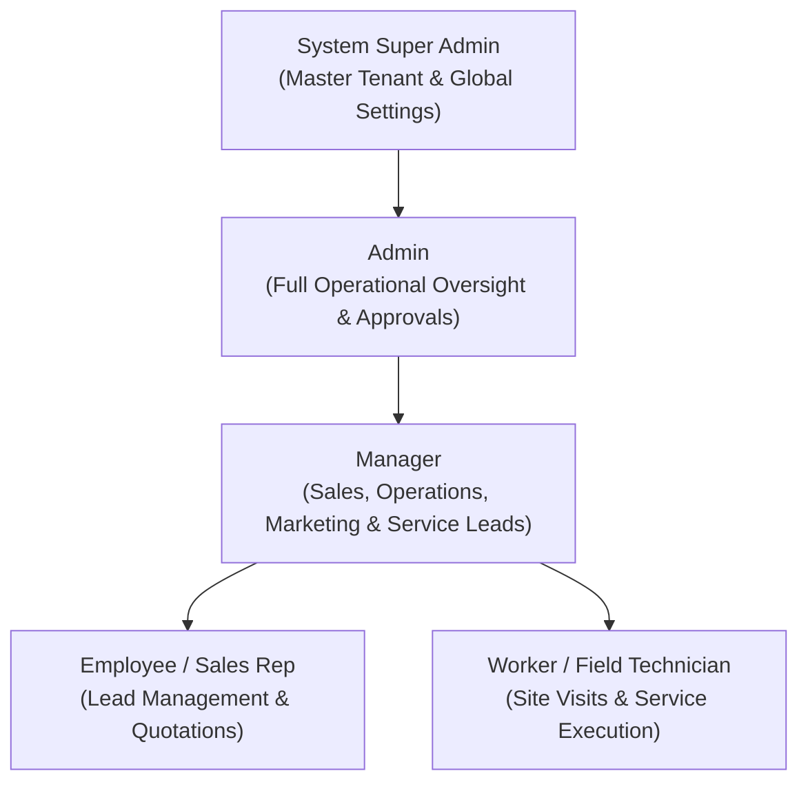
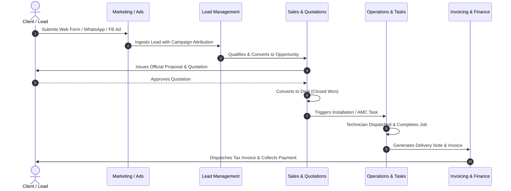
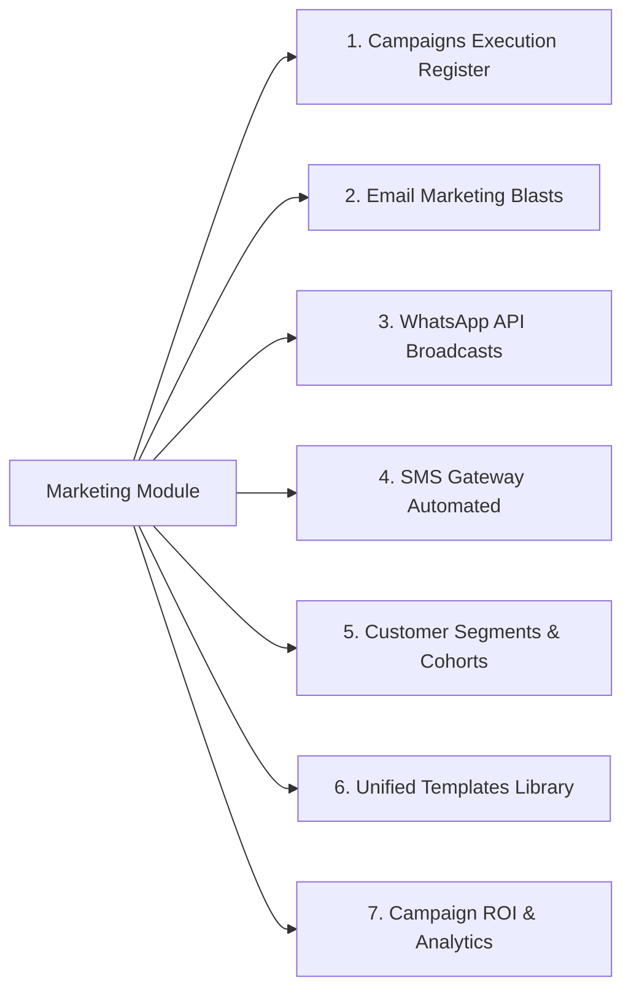
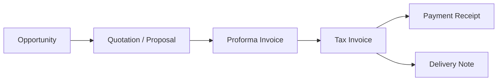

# Cool Technologies CRM - Enterprise Architecture & Complete System Documentation

---

## 1. Executive Summary & Core Purpose

**Cool Technologies CRM** is an enterprise-grade Customer Relationship Management (CRM) and Operations Orchestration Platform engineered for specialized commercial cooling, HVAC maintenance, Annual Maintenance Contracts (AMC), industrial refrigeration, and mechanical engineering enterprises across the UAE and GCC region.

The platform unifies the entire operational lifecycle:
- **Outreach & Attribution**: Multi-channel marketing (WhatsApp API, Email Blasts, SMS Gateway, Facebook Ads Sync, Google Ads).
- **Commercial Pipeline**: Lead capture, qualification, opportunity stages, proposal generation, quotation approvals, and deal closing.
- **Operations & Field Services**: Task dispatching, maintenance scheduling, technician assignments, and site visit logs.
- **Procurement & Financials**: Purchase orders, vendor management, proforma invoicing, tax invoices, receipts, and delivery notes.
- **Executive Governance & Settings**: Role-Based Access Control (RBAC), user profile permissions, sales targets, and system policies.

---

## 2. Technology Stack & Technical Foundation

| Layer | Technologies & Libraries | Purpose / Implementation |
| :--- | :--- | :--- |
| **Framework** | **Next.js 15+ (App Router)** | Server & Client component architecture with nested routing and suspense boundaries |
| **Language** | **TypeScript 5+** | Strict typing across CRM models, events, and API interfaces |
| **Styling & UI** | **Tailwind CSS + Custom Design System** | Rich glassmorphism, responsive grid layouts, custom HSL color palettes, micro-animations |
| **Icons & Media** | **Lucide React** | Consistent enterprise icon taxonomy |
| **State Management** | **React Context API (`EnterpriseCrmContext`)** | Central reactive state with cross-tab and cross-component synchronization |
| **Storage & Persistence** | **Browser LocalStorage + Custom Event Bus** | Persistent frontend state with `CustomEvent` dispatches (`crm_campaigns_updated`, etc.) |
| **Mock Architecture** | **Service Layer Pattern (`authMockService`, `adminMockService`)** | 1:1 async method signatures for clean backend API integration |

---

## 3. Role-Based Access Control (RBAC) & User Hierarchy

The application enforces a granular 5-tier role hierarchy:



### Role Profiles & Scope Breakdown:

1. **System Super Admin**:
   - Complete system privileges, security parameters, system configurations, tenant provisioning, and global database control.
2. **Admin (e.g., Muhammed Shemin)**:
   - Full operational access across all modules: Sales, Projects, Tasks, Marketing, Purchase, Reports, and Master Settings.
3. **Manager (e.g., Muhammed Shibil)**:
   - Departmental oversight: Team KPI tracking, quotation approvals, campaign creation, lead allocation, and task delegation.
4. **Employee / Sales Representative (e.g., Mohammed Rashid)**:
   - Inbound/outbound lead follow-up, quotation drafting, customer relations, and activity logging.
5. **Worker / Field Technician (e.g., Field Team)**:
   - Task completion logs, emergency HVAC breakdown reporting, timesheets, and site inspection status.

---

## 4. End-to-End Operational Lifecycle & Workflows

### 4.1 Lead-to-Cash & Project Delivery Workflow



---

## 5. Comprehensive Module-by-Module Breakdown

### 5.1 Marketing & Outreach Operations (`/marketing` & `/manager/marketing`)

The Marketing module is unified across both Admin and Manager portals with 7 distinct sub-views:



1. **Campaigns Register (`?tab=campaigns`)**:
   - Executive KPI Stat Cards: Total Campaigns, Active Campaigns, Leads Generated, Budget Allocated (AED).
   - Facebook Lead Import: Instant Form synchronization into CRM pipeline.
   - Meta / Facebook Ads Integration: OAuth token, Meta Pixel ID, and conversion webhook sync.
   - Master Table: `SL.NO`, `OWNER`, `CAMPAIGN NAME`, `TYPE`, `STATUS`, `START DATE`, `END DATE`, `LISTING` toggle, and `ACTIONS` gear dropdown (`View Leads & ROI`, `Pause/Resume`, `Duplicate`, `Delete`).
   - Dedicated Full-Page Campaign Creator: [`/manager/marketing/create`](file:///c:/Users/User/OneDrive/Documents/CRM/src/app/manager/marketing/create/page.tsx) and [`/marketing/campaigns/create`](file:///c:/Users/User/OneDrive/Documents/CRM/src/app/marketing/campaigns/create/page.tsx).

2. **Email Marketing (`?tab=email`)**:
   - Delivery rate, open rate, click-through rate (CTR) metrics.
   - Email blast composer with sender email routing and target segment selection.

3. **WhatsApp Campaigns (`?tab=whatsapp`)**:
   - Official WhatsApp Business API connection status.
   - Broadcast register with delivered %, read %, and customer response tracking.

4. **SMS Campaigns (`?tab=sms`)**:
   - SMS gateway credits balance, DLT compliance, sender ID headers (`COOLTECH`), character counter, and instant/scheduled dispatch.

5. **Customer Segments (`?tab=segments`)**:
   - Smart cohort grouping by industry (Malls, Commercial Towers, Residential), location (Dubai, Abu Dhabi, Sharjah), annual spend threshold, and active AMC status.

6. **Templates (`?tab=templates`)**:
   - Multi-channel message templates (Email, WhatsApp, SMS) with dynamic variables (`{{customer_name}}`, `{{service_type}}`).

7. **Campaign Reports (`?tab=reports`)**:
   - Master ROI breakdown table, Cost Per Lead (CPL), deals won, and revenue attribution analytics.

---

### 5.2 Tasks & Operations Management (`/tasks` & `/manager/tasks`)

- **View Modes**: List View, Interactive Kanban Board (Pending, In Progress, Waiting, Completed), and Calendar Schedule.
- **Task Prioritization**: Urgent, High, Medium, Low flags with SLA countdowns.
- **Workflow Actions**: Task creation, technician re-assignment, activity log audit trail, subtask checklist, and status transitions.

---

### 5.3 Leads & Pipeline Management (`/leads` & `/manager/leads`)

- **Lead Capture & Ingestion**: Automated ingestion from Marketing campaigns, direct website forms, cold calls, and manual entries.
- **Rating & Status**: Hot / Warm / Cold scoring, conversion stages (New -> Contacted -> Qualified -> Proposal Sent -> Converted/Won -> Lost).
- **Follow-up Engine**: Automated reminder dates, call logs, meeting scheduling, and assignment to sales reps.

---

### 5.4 Customers & AMC Accounts (`/customers` & `/manager/customers`)

- **Customer Master Directory**: Commercial facilities, real estate groups, hotel chains, and residential associations.
- **Contract & AMC Management**: Active AMC contract duration, equipment breakdown inventory (Chillers, VRF, Package Units, AHU), and service history.
- **Account Ledger**: Complete financial overview, pending invoices, quotations issued, and contact person directory.

---

### 5.5 Sales, Commercials & Financial Flow (`/sales` & `/manager/sales`)

The Sales pipeline manages commercial documents sequentially:



- **Quotation Generator**: Line items with unit pricing, VAT (5% UAE), discounts, terms & conditions, and PDF preview.
- **Approval Engine**: Manager quotation approval for high-value contracts.

---

### 5.6 Reports & Business Intelligence (`/reports` & `/manager/reports`)

- **Standardized Reports**:
  - Sales Target vs Achievement by Sales Rep.
  - Campaign Attribution & ROI Master Log.
  - Field Service & Technician SLA Performance.
  - Customer Statement of Accounts & Aging Reports.
- **Export Capabilities**: Clean CSV / Excel export formats.

---

### 5.7 System Settings & Master Configuration (`/settings`)

- **Users Directory (`?tab=users`)**: User creation, credential management, profile assignment, and status controls.
- **User Profiles (`?tab=profile`)**: Role privilege definitions (`Employee`, `Manager`, `Worker`), module permissions (`Sales`, `Project`, etc.), data scope (`All`, `Team`, `Own`), and action permissions.
- **User Targets (`?tab=user-target`)**: Monthly & annual sales quotas, target revenue, and target deals.
- **Opportunity Stages (`?tab=opportunity-stages`)**: Probability % mapping and pipeline stages.
- **Initial Settings & Masters**: Lead sources, customer groups, product categories, cost job types, tags, and system parameters.

---

## 6. Directory Structure & Codebase Organization

```
CRM/
├── src/
│   ├── app/                                 # Next.js App Router Pages & API
│   │   ├── admin/                           # Admin dedicated dashboard
│   │   ├── customers/                       # Customer directory, contacts, activities
│   │   ├── dashboard/                       # Executive analytics dashboard
│   │   ├── employee/                        # Employee portal
│   │   ├── leads/                           # Lead directory, sources, status, import
│   │   ├── login/                           # Authentication & role-switch login
│   │   ├── manager/                         # Manager operations portal
│   │   │   ├── dashboard/                   # Manager executive overview
│   │   │   ├── leads/                       # Manager lead supervision
│   │   │   ├── marketing/                   # Manager marketing & campaigns
│   │   │   │   ├── create/                  # Full-page campaign builder
│   │   │   │   └── page.tsx                 # Unified 7-tab marketing module
│   │   │   ├── purchase/                    # Manager procurement approvals
│   │   │   ├── reports/                     # Manager team analytics
│   │   │   ├── sales/                       # Manager commercial oversight
│   │   │   ├── settings/                    # Manager configurations
│   │   │   └── tasks/                       # Manager task distribution
│   │   ├── marketing/                       # Admin / Super Admin marketing operations
│   │   │   ├── campaigns/                   # Campaign directory & create page
│   │   │   ├── email/                       # Email marketing blasts
│   │   │   ├── reports/                     # Marketing ROI reports
│   │   │   ├── segments/                    # Customer cohort builder
│   │   │   ├── sms/                         # SMS campaign gateway
│   │   │   ├── templates/                   # Multi-channel template library
│   │   │   ├── whatsapp/                    # WhatsApp Business broadcasts
│   │   │   └── page.tsx                     # Unified root marketing router
│   │   ├── purchase/                        # Procurement, vendors, purchase orders
│   │   ├── reports/                         # Master analytics & BI
│   │   ├── sales/                           # Deals, quotes, invoices, receipts
│   │   ├── settings/                        # Master settings, profiles, users, RBAC
│   │   ├── super-admin/                     # Super admin master controls
│   │   ├── tasks/                           # Central task board (Kanban / List / Calendar)
│   │   ├── worker/                          # Field technician execution interface
│   │   ├── globals.css                      # Global design system tokens & theme styles
│   │   └── layout.tsx                       # Root HTML shell & context providers
│   ├── components/                          # Modular UI Components
│   │   ├── layout/                          # AppShell, ManagerShell, Header, Sidebar
│   │   ├── settings/                        # ProfileTab, UsersTab, RbacTab, TargetsTab, etc.
│   │   └── ui/                              # Modal, BackButton, Input, Tabs, Button, Card
│   ├── config/                              # Static Configuration & Navigation
│   │   ├── enterprise-navigation.ts         # Role-based navbar schemas & dropdown links
│   │   └── navigation.ts                    # Legacy navigation configurations
│   ├── context/                             # Global Application State
│   │   └── EnterpriseCrmContext.tsx         # Central state, CRUD operations & persistence
│   ├── data/                                # Master Seed & Mock Data
│   │   ├── mockEnterpriseData.ts            # Enterprise CRM dataset (leads, tasks, customers)
│   │   └── settingsMockData.ts              # Profiles, tags, opportunity stages, sources
│   ├── services/                            # Async Service & Authentication Layer
│   │   ├── adminMockService.ts              # Admin CRUD service handlers
│   │   ├── authMockService.ts               # User authentication & permission resolver
│   │   ├── superAdminMockService.ts         # Super Admin tenant management
│   │   └── workerMockService.ts             # Field worker task actions
│   └── types/                               # TypeScript Definitions
│       ├── enterprise-crm.ts                # Core domain interfaces (Campaign, Task, Deal)
│       ├── settings.ts                      # Profile, User, Tag, Stage models
│       └── super-admin.ts                   # Tenant & Super Admin contracts
├── README.md                                # Project summary & launch instructions
└── PROJECT_DOCUMENTATION.md                 # Complete Master Architecture Specification
```

---

## 7. State Management & Event Synchronization Architecture

The platform uses a synchronized hybrid state model combining **React Context (`EnterpriseCrmContext`)** with **Browser LocalStorage** and a custom **Event Bus** to ensure real-time consistency across windows, tabs, and role switches.

### Active Event Dispatches:

| Event Name | Trigger | Affected Components / State |
| :--- | :--- | :--- |
| `crm_campaigns_updated` | Campaign created, edited, paused, or deleted | Marketing Register, Manager Marketing, Reports |
| `crm_profiles_updated` | Profile created, updated, or permissions modified | Settings ProfileTab, UsersTab, RBAC |
| `crm_users_updated` | New user created or role changed | UsersTab, Assignee Dropdowns, ProfileTab |
| `crm_leads_updated` | Lead qualified, converted, or status altered | Leads Directory, Sales Opportunities, Dashboard |
| `crm_tasks_updated` | Task assigned, status moved on Kanban | Task Board, Manager Overview, Calendar |

---

## 8. Deployment & Running Locally

### Development Server:
```bash
npm run dev
```
Runs the application on `http://localhost:3000`.

### Type Safety Validation:
```bash
npx tsc --noEmit
```
Verifies zero TypeScript compiler errors across all routes and components.

### Production Build:
```bash
npm run build
npm run start
```

---

*Document generated for Cool Technologies CRM Enterprise Platform — Up to date as of September 29, 2026.*
 